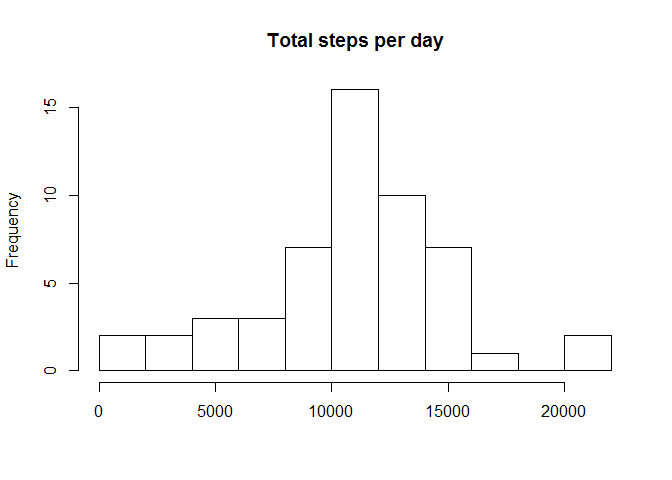
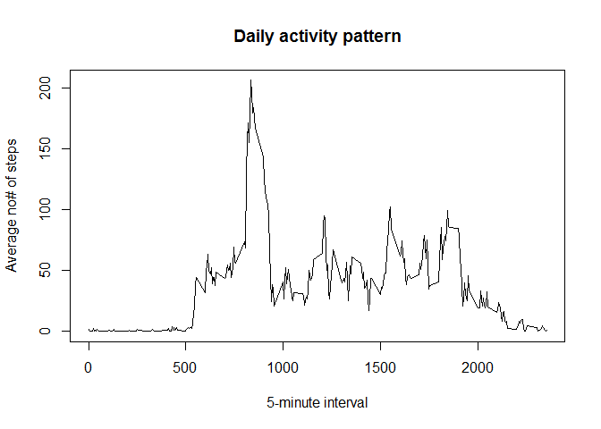
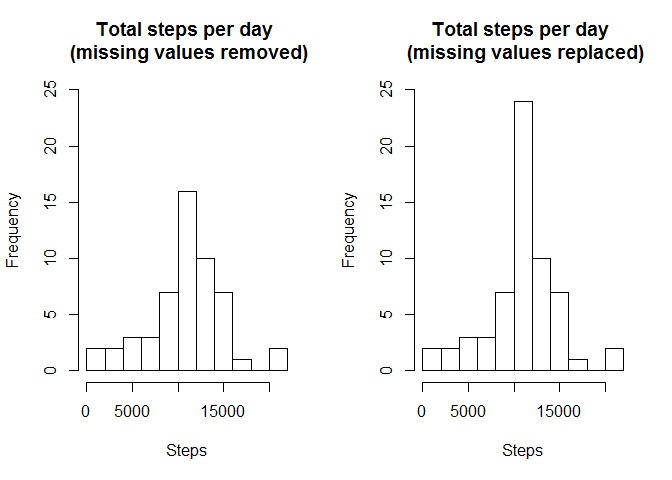
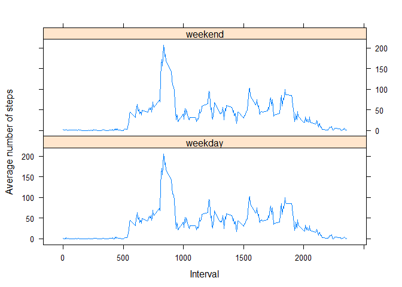

# Reproducible Research: Peer Assessment 1

## A. Introduction

This is the first assignment for the course Reproducable Research of the John Hopkins Data Science Specialization.

### The data

The data consists of two months of data from an anonymous individual collected during the months of October and November 2012 and include the number of steps taken in 5 minute intervals each day.

The variables included in this dataset are:

- steps: Number of steps taking in a 5-minute interval (missing values are coded as NA)

- date: The date on which the measurement was taken in YYYY-MM-DD format

- interval: Identifier for the 5-minute interval in which measurement was taken

The dataset is stored in a comma-separated-value (CSV) file which is zipped
There are a total of 17,568 observations in this dataset.

## B. Preprocessing the data

We first unpack the file and then load the dataset in R:


```r
filename <- unzip("repdata-data-activity.zip")
StepData <- read.csv(file = filename, header = TRUE, sep = ",")
str(StepData)
```

```
## 'data.frame':	17568 obs. of  3 variables:
##  $ steps   : int  NA NA NA NA NA NA NA NA NA NA ...
##  $ date    : Factor w/ 61 levels "2012-10-01","2012-10-02",..: 1 1 1 1 1 1 1 1 1 1 ...
##  $ interval: int  0 5 10 15 20 25 30 35 40 45 ...
```

Summary of the data to explore how many missing values there are.

```r
summary(StepData)
```

```
##      steps                date          interval     
##  Min.   :  0.00   2012-10-01:  288   Min.   :   0.0  
##  1st Qu.:  0.00   2012-10-02:  288   1st Qu.: 588.8  
##  Median :  0.00   2012-10-03:  288   Median :1177.5  
##  Mean   : 37.38   2012-10-04:  288   Mean   :1177.5  
##  3rd Qu.: 12.00   2012-10-05:  288   3rd Qu.:1766.2  
##  Max.   :806.00   2012-10-06:  288   Max.   :2355.0  
##  NA's   :2304     (Other)   :15840
```

The first analyzing of the data we do with the missing values deleted.


```r
StepDataRemovedNA <- StepData[which(!is.na(StepData$steps)),]
```

## C. Total steps, mean steps and median steps taken per day

We would like to know what is the total number of steps taken a day for those 61 days in the dataset.

### 1. Calculate the total steps per day

```r
TotalStepsPerDay <- tapply(StepDataRemovedNA$steps, StepDataRemovedNA$date, sum)
```

### 2. and display it in a histogram


```r
hist(TotalStepsPerDay, 10, main = "Total steps per day", xlab = "")
```

 

### 3. Calculate and report the mean and the median of the total number of steps taken per day


```r
MeanSteps <- mean(TotalStepsPerDay, na.rm=TRUE)
MedianSteps <- median(TotalStepsPerDay, na.rm=TRUE)
cat("Mean of the total steps taken per day = ",  MeanSteps)
```

```
## Mean of the total steps taken per day =  10766.19
```

```r
cat("Median of the total steps taken per day = ",  MedianSteps)
```

```
## Median of the total steps taken per day =  10765
```

## D. Daily activity pattern

### 1. Calculate the average steps taken spread during the days and show plot


```r
MeanStepsInterval <- aggregate(x=list(MeanSteps=StepDataRemovedNA$steps), 
                               by=list(interval=StepDataRemovedNA$interval), 
                               FUN=mean, na.rm=TRUE)
str(MeanStepsInterval)
```

```
## 'data.frame':	288 obs. of  2 variables:
##  $ interval : int  0 5 10 15 20 25 30 35 40 45 ...
##  $ MeanSteps: num  1.717 0.3396 0.1321 0.1509 0.0755 ...
```

and display in a plot


```r
plot(MeanStepsInterval$interval, MeanStepsInterval$MeanSteps, 
     xlab= "5-minute interval", ylab = "Average no# of steps", 
     main = "Daily activity pattern", 
     type = "n")
lines(MeanStepsInterval$interval, MeanStepsInterval$MeanSteps)
```

 

### 2. calculate the interval when the number of steps is the highest.


```r
MostSteps <- MeanStepsInterval[which.max(MeanStepsInterval$MeanSteps),]
cat("The interval with the most avarage steps is", MostSteps$interval, 
    "with the avarge number of steps", MostSteps$MeanSteps)
```

```
## The interval with the most avarage steps is 835 with the avarge number of steps 206.1698
```

## E. Imputing missing values

### 1.Total number of missing values in the dataset for steps. 

In an earlier stage we saw that there are no missing values in the other columns date and interval. So in this case is sufficient only calculate for the field steps.

```r
NoOfNAs <- length(which(is.na(StepData$steps)))
cat("Number of missing values =", NoOfNAs)
```

```
## Number of missing values = 2304
```

### 2. Strategy for filling missing values

Devise a strategy for filling in all of the missing values in the dataset. The strategy does not need to be sophisticated. For example, you could use the mean/median for that day, or the mean for that 5-minute interval, etc.

In the next step we will replace the missing values by the avarage steps taken per interval.


### 3. Create a dataset with filling the missing values according to the chosen stategy

We will create a new dataset, where the missing values will be filled with the mean of the interval.
The method used is:

- split the original dataset into rows with missing values and without missing values (is already available)

- in the dataset with missing values, adding the mean of the interval

- merge the two datasets together to the 'orignal' dataset.

In an earlier stage a table without missing values was already created. Now we only need a table with only the rows with the missing values.
After the creation of the dataset with the missing values and after the replacement of the missing values, the dataset parts are joined together again to ine dataset.


```r
StepDataWithNARows <- StepData[which(is.na(StepData$steps)),]
StepDataWithNARowsFill <- merge(x = StepDataWithNARows, 
                                y = MeanStepsInterval, 
                                by = "interval")

## Select only the columns which are necessary and the same as in table StepDataRemovedNA
StepDataWithNARowsFill <- StepDataWithNARowsFill[c("MeanSteps", "date", "interval") ]
names(StepDataWithNARowsFill) <- c("steps", "date", "interval")

## Variable StepDataRemovedNA contains all the rows without a missing value
## Merge the datasets StepDataRemovedNA and StepDataWithNARowsFill together
StepDataNew <- rbind(StepDataRemovedNA, StepDataWithNARowsFill)
```

### 4. What is the difference between deleting and replacing missing values?

Calculate the total steps per day with the missing values replaced by mean of the steps of the interval.

```r
TotalStepsPerDayNew <- tapply(StepDataNew$steps, StepDataNew$date, sum)
```

Display both histograms to see the difference

```r
par(mfrow = c(1, 2))
hist(TotalStepsPerDay, 10, 
     main = "Total steps per day \n (missing values removed)", 
     xlab = "Steps", ylim = c(0,25))

hist(TotalStepsPerDayNew, 10, 
     main = "Total steps per day \n (missing values replaced)", 
     xlab = "Steps", ylim = c(0,25))
```

 


Calculate and report the mean and the median of the total number of steps taken per day


```r
MeanStepsNew <- mean(TotalStepsPerDayNew)
MedianStepsNew <- median(TotalStepsPerDayNew)
cat(" Mean of the total steps taken per day with missing values removed = ",  
    MeanSteps, "\n", 
    "Mean of the total steps taken per day with missing values filled =", MeanStepsNew)
```

```
##  Mean of the total steps taken per day with missing values removed =  10766.19 
##  Mean of the total steps taken per day with missing values filled = 10766.19
```

```r
cat(" Median of the total steps taken per day with missing values removed = ",
    MedianSteps, "\n", 
    "Median of the total steps taken per day with missing values filled =", MedianStepsNew)
```

```
##  Median of the total steps taken per day with missing values removed =  10765 
##  Median of the total steps taken per day with missing values filled = 10766.19
```

The difference between the missing values removed and the missing values replaced by the mean of the interval is:

For the mean the difference is:

```r
MeanStepsNew - MeanSteps
```

```
## [1] 0
```

For the median the difference is:

```r
MedianStepsNew - MedianSteps
```

```
## [1] 1.188679
```

## F. Are there differences in activity patterns between weekdays and weekend?

For analyzing this question the dataset with the replaced missing values is used.


```r
StepDataNew$day <- weekdays(as.Date(StepDataNew$date))
StepDataNew$week_weekend <- as.factor(c("weekend", "weekday"))
StepDataNew[StepDataNew$day == "zondag" | StepDataNew$day == "zaterdag", 5] <- factor("weekend")
StepDataNew[!(StepDataNew$day == "zondag" | StepDataNew$day == "zaterdag"), 5] <- factor("weekday")

StepDataNew$day <- weekdays(as.Date(StepDataNew$date))
StepDataNew$wd <- as.factor(c("weekend", "weekday"))
StepDataNew[StepDataNew$day == "zondag" | StepDataNew$day == "zaterdag", 5] <- factor("weekend")
StepDataNew[!(StepDataNew$day == "zondag" | StepDataNew$day == "zaterdag"), 5] <- factor("weekday")
```


```r
## Calculate avarage steps per weekday/weekend and per interval
MeanStepsWeekday <- aggregate(x=list(MeanSteps=StepDataNew$steps), 
                                 by=list(wd = StepDataNew$wd, interval=StepDataNew$interval), 

                              FUN=mean)
## Create plot using Lattice
library(lattice)
xyplot(MeanSteps ~ interval| wd, data = MeanStepsWeekday, 
       xlab="Interval", ylab="Average number of steps",
       layout = c(1,2), type = "l")
```

 

From the graphs we learn that the activity during the day on weekends and weekdays is different.
